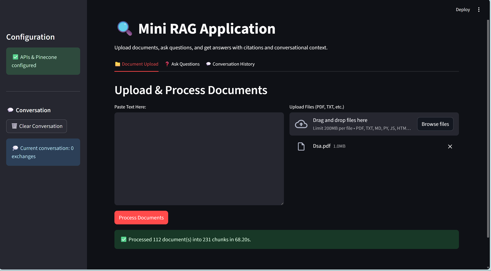

# Submission for ProcessVenue (Track B : AI Engineer assessment) - by Yash Kahalkar
# 🌟[Live URL](https://mini-rag-0sm6.onrender.com/)
# Mini RAG App 🔍

A sophisticated, yet easy-to-use, Retrieval-Augmented Generation (RAG) application built with Streamlit and orchestrated by LangChain. This tool allows you to upload your own documents, ask questions about them, and receive context-aware, cited answers. It features a complete RAG pipeline including document processing, embedding, vector storage, retrieval, reranking, and conversational memory.

***

### Demo 🎬

**Here are some Screenshots**

***

## ✨ Features

* **📄 Multi-Format Document Upload:** Ingest and process various file types including `.pdf`, `.txt`, `.md`, and more.
* **✍️ Text Input:** Directly paste text for quick analysis.
* **🚀 Advanced RAG Pipeline:**
    * **Embedding:** Utilizes Google's powerful `text-embedding-004` model for efficient vectorization.
    * **Vector Storage:** Employs **Pinecone's** serverless vector database for scalable, fast retrieval.
    * **Retrieval & Reranking:** Implements a two-stage retrieval process with an initial vector search followed by **Cohere's Rerank** model for enhanced relevance.
    * **Generation:** Leverages the **Gemini 1.5 Pro** model for generating insightful and accurate answers.
* **🧠 Conversational Memory:** Remembers the context of the current conversation to answer follow-up questions effectively.
* **📚 Source Citations:** Provides the specific source documents used to generate an answer, complete with relevance scores.
* **💬 Clear History:** A dedicated tab to review your entire conversation history.

***

## 🏗️ Architecture

The application follows a modern RAG pipeline orchestrated by LangChain Expression Language (LCEL).

***
# Configuration Details
The core components of the RAG pipeline are configured as follows:

Chunking Parameters
Strategy: RecursiveCharacterTextSplitter from LangChain.

Chunk Size: 1,000 characters.

Chunk Overlap: 200 characters. This overlap helps maintain context between chunks.

Retrieval & Reranking Settings
Providers Used:

Vector Store / Retriever: Pinecone

Reranker: Cohere

Process:

Initial Retrieval: The retriever fetches a broad set of 20 candidate documents from Pinecone based on vector similarity to the user's query.

Reranking: The Cohere Rerank model (rerank-english-v3.0) re-evaluates these 20 documents against the query for semantic relevance and returns the final, most accurate set of documents. The number of final documents is controlled by the slider in the UI (defaulting to 5).

***

# 🚀 Getting Started (Quick Start)
Follow these steps to get the application running on your local machine.

* **Clone the repo**
* **install requirements.txt**
* **run app.py in terminal as streamlit run app.py**

***

# ⚠️ Remarks & Trade-offs
Provider API Limits
  Gemini Free Tier: This application makes heavy use of the Google Gemini API for both e  mbeddings and generation. The free tier is very limited (e.g., ~5 requests per minute). Processing a large document can easily trigger a 429 ResourceExhausted error because each chunk requires a separate embedding call.

Solution: For any serious use, you must enable billing on your Google Cloud Project. This will move you to a pay-as-you-go plan with significantly higher rate limits.

Trade-offs Made
Cost vs. Quality: Using Gemini 2.5 flash and a Cohere Reranker provides high-quality, relevant answers but comes at a higher latency and API cost compared to a simpler setup. For faster or cheaper processing, one could use a model like Gemini 1.5 Flash and remove the reranking step.

Chunking Strategy: The fixed-size chunking strategy is a good general-purpose approach. However, for highly structured documents (like code, tables, or legal texts), more advanced, context-aware chunking methods might yield better retrieval results.

Response Generation: The app currently waits for the full response from the LLM before displaying it. A more advanced implementation could stream the response token-by-token to improve the perceived performance and user experience.
